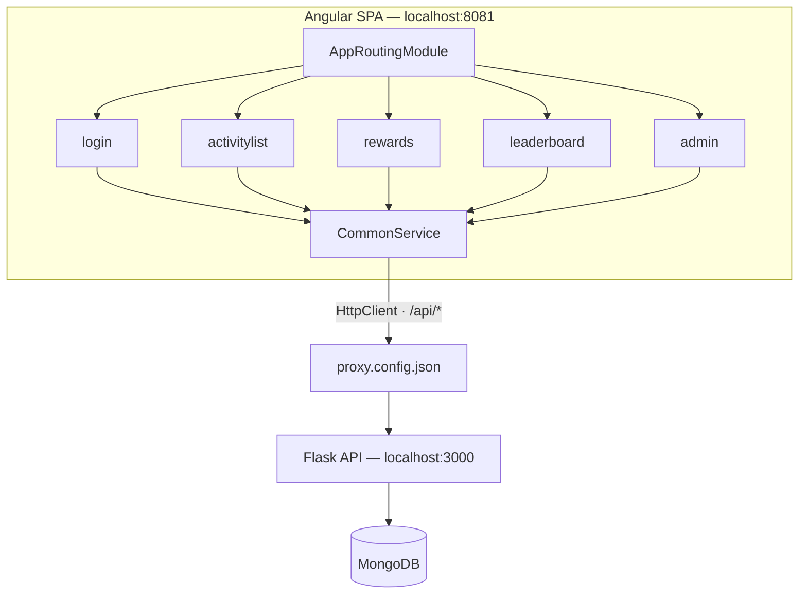

# School Rewards Web

A student engagement app for a high school rewards program. Students browse school events, enroll to bank points, and track their standing on a leaderboard; staff verify attendance from an admin console. Built with **Angular 15**, **TypeScript**, and **ag-Grid**.

This is the frontend. The Flask + MongoDB backend lives in **[school-rewards-api](https://github.com/yinbri/school-rewards-api)**.

<sub>Built in grade 11 (Feb–Mar 2023) as my first Angular application — see [Notes on the code](#notes-on-the-code) for an honest read on what I'd do differently now.</sub>

<!--
  Screenshot slot — drop a PNG at docs/screenshot.png and uncomment:
  
-->

---

## What it does

The app has two distinct user journeys behind one navigation bar.

**Students** sign up with a school email, browse the events they're eligible for, and enroll with a click. Enrolling banks *pending* points; once staff confirm attendance those become *earned* points. A rewards page shows both totals alongside the underlying activity history.

**Staff** sign in through a separate admin login and get an editable grid of every student's activity records. Changing a row's status to `Attended` writes back through the API and moves that student's points from pending to earned.

**Everyone** can see the leaderboard — the top students by total points — without signing in.

### Feature highlights

- **Role-separated routing** — student and admin flows have independent logins, and the navbar shows different items depending on authentication state
- **Editable data grids** — ag-Grid with sorting, filtering, and a dropdown cell editor that commits status changes straight to the API
- **Responsive by detection** — `ngx-device-detector` identifies mobile browsers and the components trim non-essential UI to fit smaller screens
- **Session persistence** — signed-in state survives a page refresh via `sessionStorage`
- **Zero-CORS development** — a dev-server proxy forwards `/api/*` to Flask so both halves behave as one origin

---

## Architecture



`CommonService` is the single seam between the UI and the backend: every component talks to it, and it owns all HTTP calls, authentication state, and the mobile flag. Swapping the backend means touching one file.

---

## Running it locally

**Prerequisites:** Node.js 18+, and the [school-rewards-api](https://github.com/yinbri/school-rewards-api) backend running on port 3000. Start the API first — the app has no mock mode.

```bash
git clone https://github.com/yinbri/school-rewards-web.git
cd school-rewards-web
npm install
npm start -- --port 8081
```

Open **http://localhost:8081**. (If `localhost` misbehaves, try `http://[::1]:8081`.)

### Sign in with

| Role | Username | Password | Entry point |
|---|---|---|---|
| Student | `brian@gmail.com` | `test` | **Student** in the navbar |
| Admin | `admin` | `admin` | **Admin** in the navbar |

### Other commands

```bash
npm run build     # production build to dist/
npm test          # unit tests via Karma + Jasmine
```

---

## Project structure

```
src/
├── app/
│   ├── app-routing.module.ts        # Route table
│   ├── app.component.*              # Shell: navbar + router outlet, mobile detection
│   ├── components/
│   │   ├── about/                   # Landing page and program explainer
│   │   ├── login/                   # Student sign-in and sign-up (one component, two routes)
│   │   ├── logout/
│   │   ├── activitylist/            # Browsable events, enroll/unenroll (ag-Grid)
│   │   ├── rewards/                 # A student's points: pending vs. earned
│   │   ├── leaderboard/             # Top students, public
│   │   └── admin/                   # Staff login + attendance verification grid
│   ├── models/activity.ts
│   └── services/common.service.ts   # All API calls and auth state
├── proxy.config.json                # /api/* → http://localhost:3000
└── assets/
```

---

## Notes on the code

This was my first Angular project, written for a high school assignment, and I've left it as it was rather than quietly modernising it. Things I'd do differently today:

- **Authentication is client-side only.** A `sessionStorage` key gates the UI; nothing stops a user from navigating straight to `/admin`. Real auth needs a server-issued token and Angular route guards.
- **No route guards at all** — `CanActivate` is exactly the tool for this and I didn't know it existed yet.
- **`CommonService` is a god object.** Student calls, admin calls, auth state, and device state all live in one class; splitting it per-domain would scale better.
- **Responses are typed `any`.** Interfaces for the API contract would catch shape mismatches at compile time — the whole reason to use TypeScript.
- **The generated spec files are untouched.** Component tests were beyond the scope of the assignment.

What it does demonstrate: component-based architecture, service-mediated HTTP, reactive state with RxJS `Subject`, routing with conditional navigation, third-party grid integration, and building a frontend against an API I designed myself.

---

## License

MIT — see [LICENSE](LICENSE).
